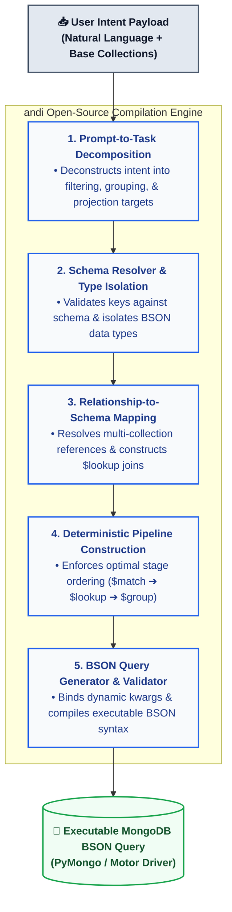

# ANDI-AI: Secure Agentic AI Data Gateway for Enterprise MongoDB 🤖🍃
[](https://pypi.org/project/andi-ai/0.1.14/)
[](https://opensource.org/licenses/MIT)
[](https://www.python.org/downloads/)

**ANDI** stands for Advanced Natural Language Database Interface. It is the Secure Agentic AI Data Gateway for Enterprise MongoDB.
We provide a deterministic middleware layer that enables AI agents and software applications to safely execute queries/aggregates on MongoDB clusters using plain text—without sacrificing speed, security, or predictability.
By leveraging **Agentic workflow**, Andi instantly translates plain English into precise MongoDB standard queries or complex multi-stage aggregation pipelines—complete with **dynamic runtime variables**. 

Stop building, maintaining, and debugging dozens of rigid, single-purpose CRUD endpoints. Consolidate your data fetching layer into a single, highly flexible, intelligent NLP endpoint.

[Wiki Links](https://pypi.org/project/andi-ai/0.1.14/)
1. [What ANDI-AI?](https://github.com/Satty27/andi-ai/wiki)
2. [Initialize MongoDB Connection](https://github.com/Satty27/andi-ai/wiki/MongoDB-connection-initialisation)
3. [Analyse Schema](https://github.com/Satty27/andi-ai/wiki/Schema-Analysis) 
4. [Text to NoSQL Query Generation](https://github.com/Satty27/andi-ai/wiki/Text%E2%80%90To%E2%80%90NoSQL-Query-Generation)
5. [Use of Runtime Variables ](https://github.com/Satty27/andi-ai/wiki/How-to-user-runtime-variables)
6. [Local Persistent Query Caching](https://github.com/Satty27/andi-ai/wiki/Persistent-Query-Caching) 
7. [Error Handling](https://github.com/Satty27/andi-ai/wiki/Error-Handling)
8. [Complete `sample_mflix` Usage Examples](https://github.com/Satty27/andi-ai/wiki/Complete-%60sample_mflix%60-Usage-Examples)
9. [Single Endpoint Architecture](https://github.com/Satty27/andi-ai/wiki/Single-Endpoint-Architecture)
10. [Recommended Pipeline and Validation ](https://github.com/Satty27/andi-ai/wiki/Recommended-Request-Pipeline-and-Validation)
11. [Usage Checklist](https://github.com/Satty27/andi-ai/wiki/Usage-Checklist)
12. [Schema First Privacy Model ](https://github.com/Satty27/andi-ai/wiki/Schema%E2%80%90First-Privacy-Model)
---

## ✨ Features

*   🗣️ **Text-to-NoSQL Translation:** Write complex database requests in plain English. Andi handles the heavy lifting, translating intent into native MongoDB query syntax.
*   🧠 **Agentic Query Planning:** Powered by **OPENAPI**, Andi deeply understands context, deeply nested structures, and relationships to construct highly accurate operations.
*   💾 **Persistent Query Caching** (**New**): Add a robust persistence layer to fetch compiled queries directly from cache, avoiding redundant query generation and significantly reducing token usage.
*   🔒 **Privacy-First Schema Isolation:** Andi connects to your database, infers the shape of your collections, and caches the structure locally. **Only the schema metadata is sent to the LLM**—your actual database records are never exposed to the agent.
*   ⚡ **Secure Runtime Variables:** Safely inject dynamic inputs into your natural language prompts at runtime, eliminating string-concatenation and prompt-injection vulnerabilities.
*   🛠️ **Complex Aggregations Out-of-the-Box:** Seamlessly generates standard `find()` queries as well as advanced `aggregate()` pipelines (`$lookup`, `$unwind`, `$group`, etc.).
*   🎯 **Single Endpoint Architecture:** Perfect for building AI agents, chatbots, or highly dynamic applications that require flexible, ad-hoc data retrieval without writing code for every new UI view.
*   ⚙️ **LLM_INTEGRATION.md**: Cloud LLM skillset instructions to set up ANDI-AI as an isolated query orchestration layer and AI firewall in front of MongoDB database.

---

## 📦 Installation

Andi is available on PyPI. Install it cleanly using `pip`:

```bash
pip install andi-ai
```

## ⚙️ Prerequisites

To run Andi, ensure you have:
1. A valid MongoDB Connection String URI.
2. An OpenAI API Key configured in your environment variables (OPENAI_API_KEY).

## 🚀 Quick Start
Here is how easily you can initialize Andi, map your schema, and execute a natural language query with dynamic runtime bindings:


### ⚡ How Runtime Variables Work (`**kwargs` Resolution)

To prevent string-concatenation vulnerabilities and prompt injection, Andi uses a strict declarative variable binding system. When you define an intent, you declare placeholders using the `${variable_name}` syntax. 

When executing the query via `run_query_executor`, you must pass these exact variables as Python keyword arguments (`**kwargs`).

### The Golden Rule of Mappings
The variable key identifier defined inside your **`runtime_inputs` object template** must match the **Python parameter key** exactly. 

| Location | Key Syntax                                                     | Example |
| :--- |:---------------------------------------------------------------| :--- |
| **1. Inside Intent JSON:** | `"runtime_inputs": [{"email": "${target_email}"}]`             | Uses `${target_email}` placeholder |
| **2. Inside `run_query_executor`:** | `vector_agent.run_query_executor(plan, target_email=variable)` | `target_email=target_email` |

---

### Detailed Breakdown Example

Here is exactly how the mapping connects from your JSON definition to execution:

```Python
from andi import Andi


class TestProject:
    def testing_nlp(self, db_session, analyzed_schemas):
        self.db = db_session
        self.analyzed_schemas = analyzed_schemas


        connection_string = "mongodb://localhost:27017"

        vector_agent = Andi(db_session=db_session, analyzed_schemas=analyzed_schemas)
        database_name = "test"

        vector_agent.initialize_connection(connection_string=connection_string, database_name=database_name)
        vector_agent.analyze_schemas(base_collections=["users", "wallets", "weekly_leaderboard"])

        #Example 1

        target_email = "test_user_8_fischertimothy@gmail.com"

        intent = {
          "intent": {
            "goal": "Find the preferred_language and name of the user where email=target_email",
            "runtime_inputs":[
                {
                    "email":"${target_email}",
                    "datatype": "string"
                }
            ],
            "projection":["name", "preferred_language"]
          }
        }
        query = vector_agent.build_nlp_query(intent=intent, query_identifier=None, retry=False)
        print(query)

        output = vector_agent.run_query_executor(nlp_query=query, target_email=target_email)
        print(output)
```

## 🏗️ How It Works


[//]: # ()
[//]: # (```mermaid)

[//]: # (graph TD)

[//]: # (    %% Styling and Color Palettes &#40;Enterprise Vibe&#41;)

[//]: # (    classDef client fill:#eef2f7,stroke:#3b82f6,stroke-width:2px,color:#1e3a8a;)

[//]: # (    classDef engine fill:#eff6ff,stroke:#2563eb,stroke-width:2px,color:#1e40af,font-weight:bold;)

[//]: # (    classDef security fill:#fff1f2,stroke:#f43f5e,stroke-width:2px,color:#9f1239;)

[//]: # (    classDef database fill:#f0fdf4,stroke:#16a34a,stroke-width:2px,color:#14532d;)

[//]: # (    classDef structural fill:#fafafa,stroke:#71717a,stroke-width:1px,color:#27272a;)

[//]: # ()
[//]: # (    %% 1. Ingestion Layer)

[//]: # (    subgraph Client_Layer ["Application Interface"])

[//]: # (        API_Call["POST /api/v1/nlp_query<br>&#40;Payload: Intent + Base Collections&#41;"]:::client)

[//]: # (    end)

[//]: # ()
[//]: # (    %% 2. Orchestration Layer)

[//]: # (    subgraph Andi_Engine ["andi Agent Engine Core"])

[//]: # (        Init["VectorAgent Initialization<br>&#40;Target Database Setup&#41;"]:::engine)

[//]: # (        SchemaAnalzer["vector_agent.analyze_schemas&#40;&#41;<br>&#40;Extracts Schemas&#41;"]:::engine)

[//]: # (        Builder["vector_agent.build_nlp_query&#40;&#41;<br>&#40;Deterministic Query Construction&#41;"]:::engine)

[//]: # (    end)

[//]: # ()
[//]: # (    %% 3. Security & Validation Layer)

[//]: # (    subgraph Security_Guardrails ["Enterprise Safety Controls"])

[//]: # (        IntentRouter{"Intent Routing<br>& Field Validation"}:::security)

[//]: # (        Sanitize{"Injection Scanning<br>& Operator Isolation"}:::security)

[//]: # (    end)

[//]: # ()
[//]: # (    %% 4. Data Execution Target)

[//]: # (    subgraph Infrastructure ["Enterprise Storage Target"])

[//]: # (        MongoCluster[&#40;"NoSQL Cluster<br>&#40;MongoDB&#41;"&#41;]:::database)

[//]: # (    end)

[//]: # ()
[//]: # (    %% Data Pipeline Connections Flow)

[//]: # (    API_Call -->|1. Transmit Payload| Init)

[//]: # (    Init -->|2. Scrape Structure Constraints| SchemaAnalzer)

[//]: # (    SchemaAnalzer -->|3. Establish Pipeline Context Boundaries| Builder)

[//]: # (    )
[//]: # (    )
[//]: # (    Builder -->|4. Inspect Fields Against Schema| IntentRouter)

[//]: # (    IntentRouter -->|Passed: Valid Fields| Sanitize)

[//]: # (    IntentRouter -.->|Failed: Reject Intent| API_Call)

[//]: # (    )
[//]: # (    Sanitize -->|5. Compile Secure BSON Native Pipeline| MongoCluster)

[//]: # (    )
[//]: # (    MongoCluster -->|6. Standard Isolated Output Cursor| API_Call)

[//]: # ()
[//]: # (    %% Apply Styles to classes)

[//]: # (    class Builder,SchemaAnalzer,Init engine;)

[//]: # (  )
[//]: # (```)

## 📖 Supported Operations

Andi features a strict read-only routing engine. It translates natural language exclusively into data-fetching operations, ensuring your production data remains completely safe from AI hallucinations or unauthorized modifications.

| Operation | Status | Capabilities | Natural Language Example | Generated Native Syntax |
| :--- | :--- | :--- | :--- | :--- |
| **`find()`** | ✅ Supported | Standard filtering, sorting, limits, and explicit field projections. | *"Find active users registered after 2025, sorted by latest."* | `{ "status": "active", "reg_date": { "$gt": "2025-01-01" } }` |
| **`aggregate()`** | ✅ Supported | Multi-stage transformations, relational joins, unwinding arrays, and grouping. | *"Join weekly leaderboards with user wallets and get top 10 scores."* | `[{ "$lookup": {...} }, { "$unwind": ... }, { "$sort": ... }]` |
| **`insert()`** | ❌ Blocked | Prevent dynamic data insertion via the NLP endpoint. | *"Add a new user to the database..."* | **Operation Denied** (Read-Only Guardrail) |
| **`update() / delete()`** | ❌ Blocked | Prevent unauthorized mutations, bulk updates, or accidental collections drops. | *"Delete all users who haven't logged in..."* | **Operation Denied** (Read-Only Guardrail) |

### 🔒 The Read-Only Safety Guarantee
> **Security Note:** Write operations are intentionally restricted at the core library layer. Even if an LLM structure attempts to formulate a mutation pipeline, Andi's execution engine will intercept and reject the command before it ever hits your MongoDB driver. This makes it completely safe for exposed API endpoints.

## 🤝 Contributing

Contributions, issues, and feature requests are welcome! If you'd like to extend support for custom database engines, optimize pipeline construction routing, or suggest features, feel free to open a pull request or check the Issues Page.

## 📄 License
This project is licensed under the MIT License - see the LICENSE file for details.